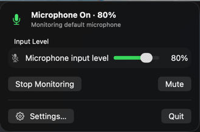
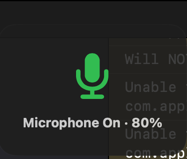
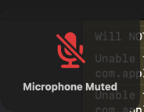
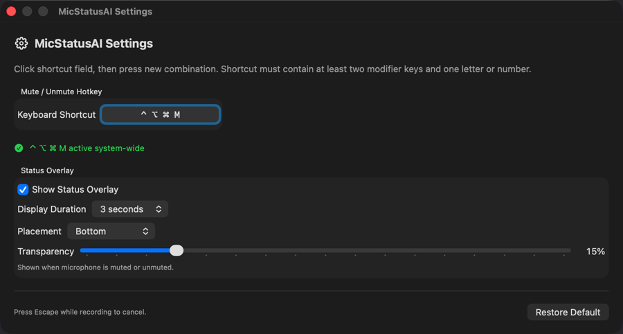

# MicStatusAI

[](https://github.com/Disconnecter/MicStatusAI/actions/workflows/pr-build.yml)

Native macOS 15+ menu-bar utility showing default microphone input-volume state.

- **Green mic:** input volume is greater than zero
- **Red muted mic:** input volume is zero
- **Gray off mic:** monitoring is stopped
- **Global hotkey:** Control-Option-M by default; configurable in Settings

MicStatusAI reads and changes CoreAudio input-volume properties. It does not capture or record audio and therefore does not request microphone-recording permission.

## Screenshots

### Status panel



### Menu-bar states

| Microphone active | Microphone muted |
| --- | --- |
|  |  |

### Status overlay

| Microphone active | Microphone muted |
| --- | --- |
|  |  |

### Settings



## Install

```sh
brew tap Disconnecter/tap
brew install --cask micstatusai
```

MicStatusAI supports Apple silicon Macs only.

> **If macOS blocks the app on first launch remove the quarantine attribute:**
>
> ```
> xattr -dr com.apple.quarantine /Applications/MicStatusAI.app
> open /Applications/MicStatusAI.app
> ```

### Direct download

Alternatively, download the app directly from the [Releases](../../releases) page.

## Build

Install project tools and generate Xcode project:

```sh
brew install xcodegen swiftlint disconnecter/l10n/l10n_xcstrings
Scripts/generate-l10n.sh
xcodegen generate
```

Open `MicStatusAI.xcodeproj` in Xcode and run the `MicStatusAI` scheme. SwiftLint runs automatically during builds.

`project.yml` is project source of truth. Generated `MicStatusAI.xcodeproj` is ignored by Git.

## Localization

Add short keys and translations to `MicStatusAI/Resources/Localizable.xcstrings`, then run `Scripts/generate-l10n.sh`. [L10nXcstrings](https://github.com/Disconnecter/L10nXcstrings) generates `MicStatusAI/Generated/L10n.swift`; never edit generated code manually.

## Contributing

See [CONTRIBUTING.md](CONTRIBUTING.md) for development setup and pull request workflow.

Some microphones, including certain digital or virtual devices, do not expose software input-volume controls. MicStatusAI reports those devices as unavailable.

## License

MicStatusAI is available under the [MIT License](LICENSE).
